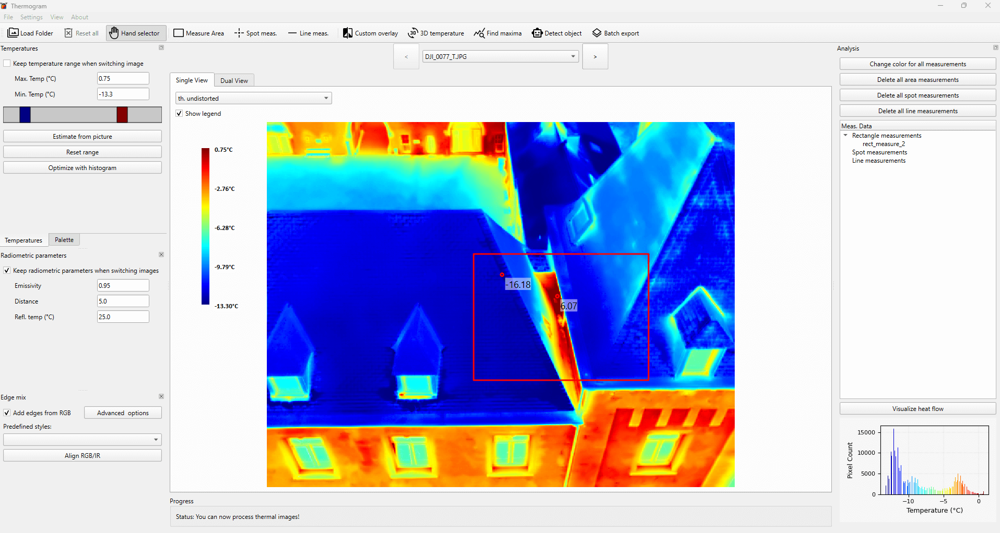
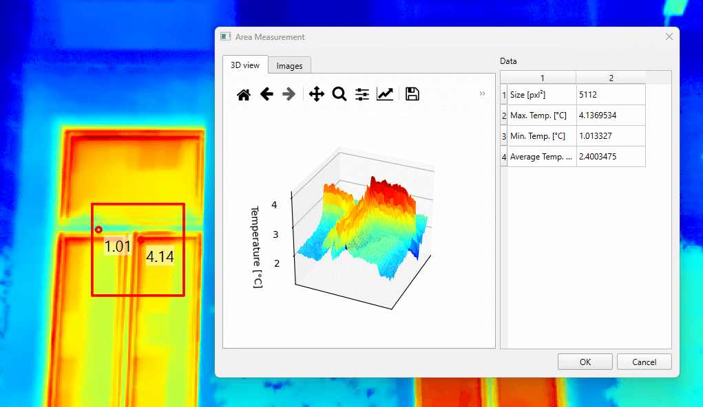
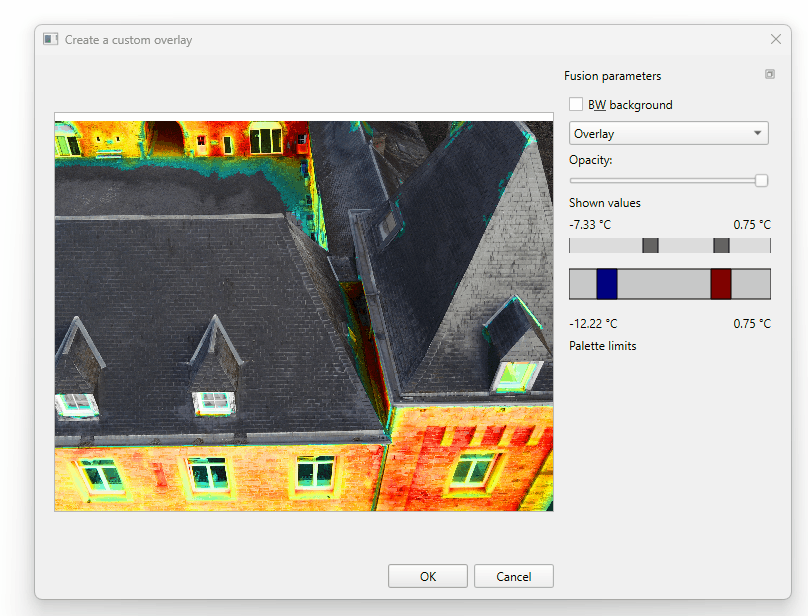
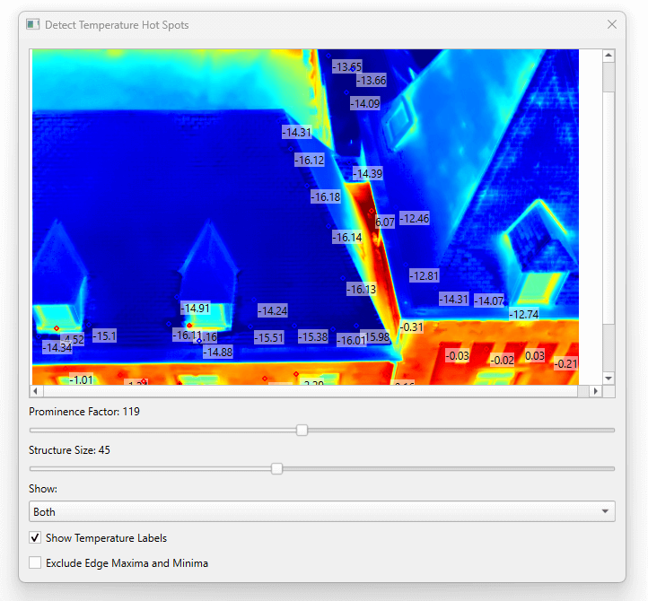
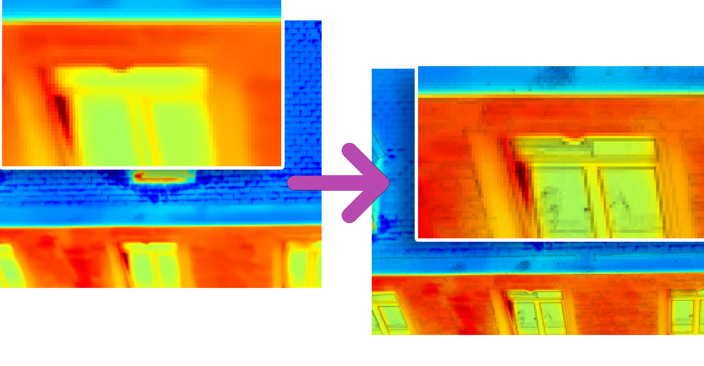
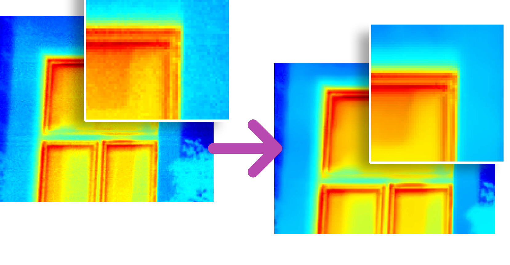

<p align="center">
    <a href=""></a>
</p>


## Overview
Thermogram is an intuitive software designed for processing infrared (IR) images from drones. DJI Thermal Analysis tool on steroids! This application leverages the capabilities of multiple libraries, such as OpenCV and Pillow, and is compatible with DJI Drones. At the moment, the app includes support for Mavic 2 Enterprise, Mavic 3 Thermal series, and M30T. The software features a user-friendly GUI, advanced visualization options, many processing options, and batch export possibilities. It includes some useful scripts such as converting DJI format to Tiff (useful for Agisoft or Pix4D processing).

**The project is still in pre-release, so do not hesitate to send your recommendations or the bugs you encountered!**

**FIRST INSTALLER AVAILABLE HERE**: https://github.com/s-du/Thermogram/releases/tag/v0.2.0

 
    <i>GUI for thermal image processing</i>

## Features
The app offers the following key features:
- Usage and visualization
    - User-friendly GUI 
    - Dual viewer for simultaneous inspection of RGB and IR data
    - 3D-viewer for viewing temperature data as 'voxels'
- Palette and temperature control
    - Includes all DJI palettes plus some custom ones
    - Advanced temperature adjustment controls
    - Advanced thermal image denoising options
- Compositing
    - Sophisticated edge overlay capabilities
    - Create customized composite images with infrared and color information superimposed
- Measurement and Analysis
    - Spot, line and rectangle measurements
    - Advanced maxima detection (local maxima and minima)
    - Grounded-DINO for object detection
    - Segment Anything (SAM) for object segmentation
- Exporting
    - Batch export functionality, including the ability to export raw data as TIFF files
    - 'Picture-in-Picture' export format
    - Upscaling for thermal images
- ...

<p align="center">
    <a href=""></a>
    
    GUI Overview
</p>

<p align="center">
    <a href=""></a>
    
    Dual viewer (easy inspection)
</p>

<p align="center">
    <a href=""></a>
    
    Standard measurements
</p>

<p align="center">
    <a href=""></a>
    
    Thermal image overlay
</p>

<p align="center">
    <a href=""></a>
    
    Find maxima
</p>

<p align="center">
    <a href=""></a>
    
    Edge overlay
</p>

<p align="center">
    <a href=""></a>
    
    Denoising
</p>

<p align="center">
    <a href=""></a>
    
    3D visualization
</p>


## Files and Structure
- `resources/`: Contains essential resources for the application.
- `tools/`: Contains essential image processing logic for the application.
- `ui/`: The user interface files for the application.
- `main.py`: The main Python script for running the application.
- `dialogs.py`: Handles the dialog logic.
- `widgets.py`: Defines Pyside6 widgets and UI components.

## Topics
- Drones
- Infrared Thermography
- Inspection
- Segmentation
- Building pathologies

## Installation

**INSTALLER AVAILABLE HERE**: https://github.com/s-du/Thermogram/releases/tag/v0.2.0

OR 

1. Clone the repository:
```
git clone https://github.com/s-du/Thermogram
```

2. Navigate to the app directory:
```
cd Thermogram
```
3. (Optional) Install and activate a virtual environment

   
4. Install the required dependencies:
```
pip install -r requirements.txt
```

5. Run the app:
```
python main.py
```
## Usage

### Open image folder
Choose a folder with DJI images. PLEASE USE THE SAME FILE ORGANIZATION AS THE ONE GENERATED BY DJI. In other words, import a folder as it is generated on the SD card.
Then the software will load images (this can take some time for large image sets, as many processing operations are undergone during import).


### Process individual images
Once loaded, individual images can be processed. Two tabs are grouped with temperature and palette control. Edge processing can be added by ticking the corresponding checkbox.

### Navigate through images
Two arrows on the top of the GUI allow to navigate through the image set. If you want to keep settings when doing so, please check the corresponding options.

### Batch export function 
The 'Batch export' action is particularly handy to export the entire photoset with the current settings.

## Coming next
We plan to implement the following functionalities:
- Automatic alignment of color and infrared images
- Automatic detection of building pathologies
- Highlighting of sharp temperature increase
- Generation of reports

## Contributing
Contributions to the Thermogram App are welcome! If you find any bugs, have suggestions for new features, or would like to contribute enhancements, please follow these steps:

1. Fork the repository.
2. Create a new branch for your feature or bug fix.
3. Make the necessary changes and commit them.
4. Push your changes to your fork.
5. Submit a pull request describing your changes.


<p align="center">
    <a href=""></a>
</p>
